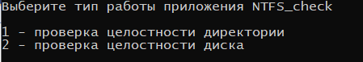

# Требования к проекту
---

# Содержание
1 [Введение](#intro)  
1.1 [Назначение](#appointment)  
1.2 [Бизнес-требования](#business_requirements)  
1.2.1 [Исходные данные](#initial_data)  
1.2.2 [Возможности бизнеса](#business_opportunities)  
1.2.3 [Границы проекта](#project_boundary)

2 [Требования пользователя](#user_requirements)  
2.1 [Программные интерфейсы](#software_interfaces)  
2.2 [Интерфейс пользователя](#user_interface)  
2.4 [Предположения и зависимости](#assumptions_and_dependencies)  
3 [Системные требования](#system_requirements)  
3.1 [Функциональные требования](#functional_requirements)  
3.1.1 [Основные функции](#main_functions)  
3.1.1.1 [Вывод информации о целостности файловой системы](#information_output)

3.1.2 [Ограничения и исключения](#restrictions_and_exclusions)  
3.2 [Нефункциональные требования](#non-functional_requirements)  
3.2.1 [Атрибуты качества](#quality_attributes)  
3.2.2 [Внешние интерфейсы](#external_interfaces)  
3.2.3 [Ограничения](#restrictions)  

<a name="intro"/>

# 1 Введение
Название проекта: "NTFS_check".

Приложение предназначено для рядового пользователя компьютера, желающего выполнить проверку целостности файловой системы NTFS.

<a name="appointment"/>

## 1.1 Назначение
В этом документе описаны функциональные и нефункциональные требования к приложению «NTFS_check"» для ОС Windows 10. Этот документ предназначен для команды, которая будет реализовывать и проверять корректность работы приложения. 

<a name="business_requirements"/>

## 1.2 Бизнес-требования

<a name="initial_data"/>

### 1.2.1 Исходные данные
У многих людей возникает ситуация, когда на компьютере один или несколько файлов повереждены, тогда требуется воспользоваться приложением или утилитой для проверки целостности файловой системы.

<a name="business_opportunities"/>

### 1.2.2 Возможности бизнеса
Многие пользователи желают компьютеров иметь приложение, которое позволит проверть целостность файловой системы, обладая минимальой технической грамотностью. Подобное приложение позволит им тратить меньше времени на поиск повреждённых файлов.

<a name="project_boundary"/>

### 1.2.3 Границы проекта
Приложение «NTFS_check» позволит пользователям просматривать информацию о состоянии файловой системы NTFS.

<a name="user_requirements"/>

# 2 Требования пользователя

<a name="user_interfaces"/>

## 2.1 Интерфейс пользователя

## Окно вывода приложение.
 

<a name="application_audience"/>

### 2.2 Аудитория приложения

Аудиторией данного приложения являются пользователи компьютеров.

<a name="system_requirements"/>

# 3 Системные требования

<a name="functional_requirements"/>

## 3.1 Функциональные требования

<a name="main_functions"/>

### 3.1.1 Основные функции

<a name="information_output"/>

#### 3.1.1.1 Вывод информации о целостности файловой системы

| Функция | Требования | 
|:---|:---|
| Проверка директории | Приложение должно предоставить пользователю возможность проверить целостность всех файлов выбранного директории |
| <a name="registration_requirements"/>Проверка всех файлов выбранного диска | Приложение должно предоставить пользователю возможность проверить целостность всех файлов выбранного диска |

<a name="non-functional_requirements"/>

## 3.2 Нефункциональные требования

<a name="quality_attributes"/>

### 3.2.1 Атрибуты качества
1. Пошаговая инструкция использования основных функций приложения отображена в справке.

<a name="external_interfaces"/>

### 3.2.2 Внешние интерфейсы
Окна приложения удобны для использования пользователями с плохим зрением:
  * размер шрифта не менее 14пт;
  * функциональные элементы контрастны фону окна.
  * язык интерфейса русский

<a name="restrictions"/>

### 3.2.3 Ограничения
1. Приложение реализовано под файловую систему NFTS операционной системы Windows 10 с использованием языка C++.